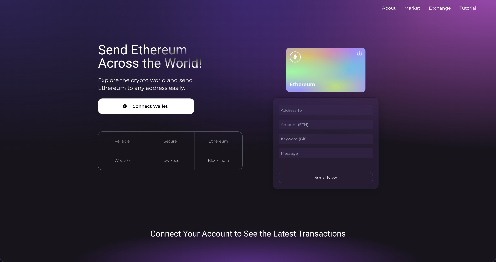

# Web 3.0 ETH Blockchain Web App

## Introduction
This is a code repository for the corresponding Web 3.0 Blockchain app video tutorial using Web 3.0 methodologies, Solidity and MetaMask.

The original repo can be found [here][repoUrl].

[repoUrl]:<https://github.com/adrianhajdin/project_web3.0>

## Available Scripts
In the project directory you can run:
### `npm run dev`
Runs the app in the development mode. 
Open [http://localhost:3000](http://localhost:3000) to view it in the browser.

You may run npm run build command to build the app.
### `npm run build`
By default, the build output will be placed at dist. You may deploy this dist folder to any of your preferred platforms.

